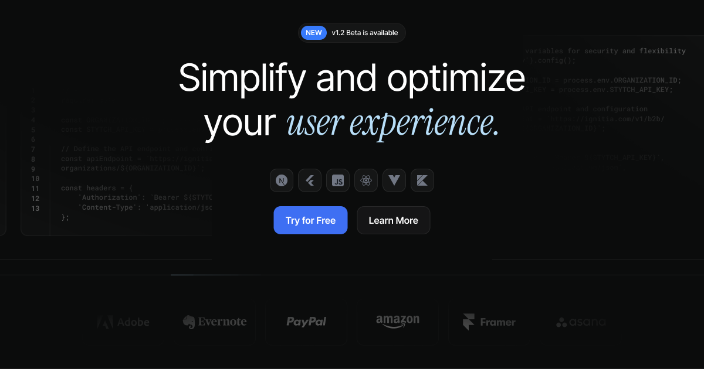

# Ignitia



Ignitia is on a mission to redefine user management—once and for all.

## 🚀 Features

- **Streamlined User Management**: Simplify authentication, authorization, and user data handling.
- **Modern Tech Stack**: Built with TypeScript, CSS, and JavaScript for robust and scalable applications.
- **High Performance**: Optimized codebase for exceptional speed and reliability.

## 🛠️ Tech Stack

- **Languages**: 
  - TypeScript (93.8%)
  - CSS (6%)
  - JavaScript (0.2%)
- **Framework**: Next.js
- **Architecture**: Component-based, scalable design.

## 📂 Directory Structure

- `public/`: Static assets including images, icons, and lottie animations.
- `src/`: Source code for components and application logic.

## 🧑‍💻 Getting Started

1. **Clone the Repository**:
   ```bash
   git clone https://github.com/umidjonvokhidov/ignitia.git
   cd ignitia
   ```

2. **Install Dependencies**:
   ```bash
   npm install
   ```

3. **Run the Development Server**:
   ```bash
   npm run dev
   ```

4. **Build for Production**:
   ```bash
   npm run build
   ```

5. **Run Tests** (if applicable):
   ```bash
   npm test
   ```

## 📜 License

This project is licensed under the [MIT License](LICENSE).
